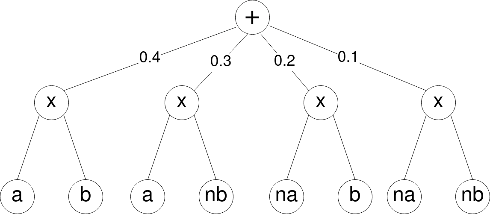
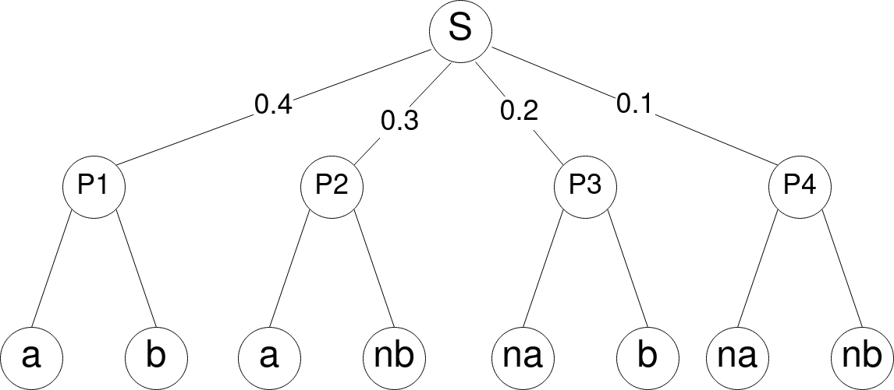

# Random Projection Circuits 

This repository contains everything you need to reproduce the paper on "[Fast And Accurate Learning of Probabilistic Circuits by Random Projections][link_artigo]"[1].

[link_artigo]: https://www.ime.usp.br/~renatolg/docs/geh21b_paper.pdf

If you're not familiar with Julia's [REPL][repl_doc] or [Pkg][pkg_doc], we highly recommend to learn about them, by entering the clickable links. To install all code dependencies,

1. Install a running version of [Julia][julialang]

2. Go to the directory where you wish to install this project

3. Type `git clone https://github.com/RenatoGeh/RPCircuits.jl` to download this repository

4. Start the [Julia REPL][repl_doc] using the command `julia`. Next, use Julia Package mode by entering the command `]`. Your screen should look like

   ```julia
   (@v1.7) pkg>
   ```

5. Inside the [package mode][pkg_doc], activate the RPCircuits environment with `activate .` and install all dependencies with `instantiate`

6. To exit package mode, type `backspace` or `Ctrl+C`

7. Start using this package by typing `using RPCircuits`

If you have a problem adding the [`BlossomV`][blossomv] package, try installing the latest version of [`gcc`][gcc] **and** `g++` **and** `make` (more to know about it [here][blossomv_build]). After installing `g++`, try building `BlossomV` inside Package mode, by typing `build BlossomV`.

Similarly, if you have a problem installing `HDF5`, `MAT` or `MLDatasets`, try building each package by typing `build Package_Name` inside Package mode.

**Note:** If you use an Arch based Linux distribution, try installing `base devel`, using he command `sudo pacman -S base-devel`. In the case of other problems with `Arpack`, `GaussianMixtures`, `HDF5`, etc, we recommend installing `julia-bin` via AUR and redo the installation process.

[julialang]: https://julialang.org/
[repl_doc]: https://docs.julialang.org/en/v1/stdlib/REPL/
[0pkg_doc]: https://pkgdocs.julialang.org/v1
[blossomv]: https://github.com/mlewe/BlossomV.jl
[blossomv_build]: https://github.com/mlewe/BlossomV.jl#building
[gcc]: https://gcc.gnu.org/


# Using RPCircuits

After the installation, you can use this package by following the next steps: go to RPCircuits' directory; enter Julia Package mode; activate RPCircuits' environment and instantiate. Your screen should look similar to this

```julia
(@v1.7) pkg> activate .
  Activating project at `~/code/RPCircuits.jl`

(RPCircuits) pkg> instantiate
┌ Warning: The active manifest file is an older format with no julia version entry. Dependencies may have been resolved with a different julia version.
└ @ ~/code/RPCircuits.jl/Manifest.toml:0

julia> using RPCircuits
```

# Building a Simple PC with RPCircuits

In this section, we teach the basics of RPCircuits package. If you're new to Sum-Product Networks or Probabilistic Circuits (PCs), previous knowledge about the subject is highly recommended (for more information, take a look [here][survey][2]).


As an example, we start building a simple Circuit with 8 indicator nodes, 4 products and 1 sum. There are different ways to build PCs using this package, the easiest one uses a bottom-up strategy. See `pc_example.ipynb` for an interactive notebook.



First we have the foundation of the PC, the **leaf** nodes. In this case the variables **a**, **b** and their respective negations **na** and **nb**. To declare an indicator leaf node using RPCircuits, we call the function `Indicator()`, that needs **two** arguments. The first argument simply refers to the variable's `scope` (the indices of the variables associated with the Indicator node). The second argument, corresponds to the `value` such that the Indicator node outputs `true` (if `value = 1.0`, the Indicator node outputs `true` only when its input is `1.0`). Using the packag we have

```julia
julia> a = Indicator(1, 1.)
Circuit with 1 node (0 sums, 0 products, 1 leaf) and 1 variable:
  1 : indicator 1 1.0
julia> b = Indicator(2, 1.)
Circuit with 1 node (0 sums, 0 products, 1 leaf) and 1 variable:
  1 : indicator 2 1.0
julia> na, nb = Indicator(1, 0.), Indicator(2, 0.)
(indicator 1 0.0, indicator 2 0.0)
```

Next, in the second layer with 4 **product** nodes. To define a product `P`, we only need to call the function `Product(v)`, where `v`  is the vector containing all children of `P`. Hence, we can build the four products of our PC by

```julia
julia> P1 = Product([a,b])
Circuit with 3 nodes (0 sums, 1 product, 2 leaves) and 2 variables:
  1 : * 1 2
  2 : indicator 2 1.0
  3 : indicator 1 1.0

julia> P2, P3, P4 = Product([a,nb]), Product([na,b]), Product([na,nb])
(* 1 2, * 1 2, * 1 2)
```

At last, we have the **sum** node. To define a sum  node `S`, we have to call the function `Sum(v, w)`, where `v` is the vector of children of `S`; and `w` is the vector of corresponding weights. This can easily be done by

```julia
julia> S = Sum([P1, P2, P3, P4], [0.4, 0.3, 0.2, 0.1])
Circuit with 9 nodes (1 sum, 4 products, 4 leaves) and 2 variables:
  1 : + 1 0.4 2 0.3 3 0.2 4 0.1
  2 : * 1 2
  3 : * 1 2
  4 : indicator 1 0.0
  5 : * 1 2
  6 : indicator 2 0.0
  7 : * 1 2
  8 : indicator 2 1.0
  9 : indicator 1 1.0
```

Hence, we have the circuit



To see the `scope` of a circuit rooted at a node `C`, we can type `scope(C)`. Therefore, the scope of our circuit is

```julia
julia> scope(S)
BitSet with 2 elements:
  1
  2
```

Using RPCircuits, it is possible to randomly sample complete configurations of the variables associated with a circuit `C`. We can do this using the function `rand(C)`, that creates a sample according to the probability defined by the PC.

```julia
julia> rand(S)
2-element Vector{Float64}:
 0.0
 1.0
```

 Passing a positive integer `N` to `rand(C, N)`, creates `N` random samples.

```julia
julia> rand(S, 1_000)
1000×2 Matrix{Float64}:
 1.0  0.0
 1.0  0.0
 1.0  0.0
 0.0  1.0
 1.0  0.0
 1.0  1.0
 1.0  0.0
 1.0  0.0
 1.0  0.0
 1.0  1.0
 1.0  0.0
 1.0  0.0
 1.0  1.0
 ⋮    
 1.0  1.0
 0.0  1.0
 1.0  0.0
 0.0  0.0
 1.0  1.0
 0.0  0.0
 1.0  1.0
 1.0  1.0
 1.0  0.0
 1.0  0.0
 1.0  0.0
 0.0  1.0
```


With the function `NLL(S, D)`, we have the `Negative Log-Likelihood` of the PC `S` w.r.t the dataset `D`.

```julia
julia> NLL(S,D)
1.2905776805822866
```


Suppose that we have an initial circuit `S_em = Sum([P1, P2, P3, P4], [0.25, 0.25, 0.25, 0.25])` and we want to learn the function `S` (such that configurations `(a,b)`, `(a,nb)`, `(na,b)` and `(na, nb)` have respective probabilities `0.4`, `0.3`, `0.2` and `0.1`). Firstly, we can check the initial `NLL` of our model `S_em` in relation to the dataset `D`.

```julia
julia> S_em = Sum([P1, P2, P3, P4], [0.25, 0.25, 0.25, 0.25])
Circuit with 9 nodes (1 sum, 4 products, 4 leaves) and 2 variables:
  1 : + 1 0.25 2 0.25 3 0.25 4 0.25
  2 : * 1 2
  3 : * 1 2
  4 : indicator 1 0.0
  5 : * 1 2
  6 : indicator 2 0.0
  7 : * 1 2
  8 : indicator 2 1.0
  9 : indicator 1 1.0

julia> println("Initial NLL = ", NLL(S_em, D))
Initial NLL = 1.3862943611198937
```

Now, we can pass both our circuit `S_em` and the dataset `D` as an input to the `EM` algorithm (Expectation-Maximization algorithm, more about it [here][murphy][3]). To do this, we first define the learner `L = SEM(S)`. Then, we have `m` calls of the `update` function, for `m` iterations of the `EM` algorithm.

```julia
julia> L_em = SEM(S_em)
julia> for i = 1:100
           update(L_em, D)
       end
```

At last, we can apply the `NLL` function another time, to see the improvement obtained by the learning process.

```julia
julia> println("Final NLL = ", NLL(S_em, D))
Final NLL = 1.2846005853473226
```

Similarly, we can use the Gradient Descent algorithm (more about it [here][murphy][3]) to learn a circuit `S_grad` w.r.t the dataset `D`. In this process, we have a sligthly different approach, because we initalize the sum-weights `w` close zero (more to know about it [here][trapp][4]), by using the `Distributions` package.

```julia
julia> using Distributions

julia> w = Distributions.rand(Distributions.truncated(Distributions.Normal(0, 0.1), 0, Inf), 4)
4-element Vector{Float64}:
 0.06188858628551688
 0.0595922631891463
 0.052955660645701744
 0.011508850149691349

julia> S_grad = Sum([P1, P2, P3, P4], w)
Circuit with 9 nodes (1 sum, 4 products, 4 leaves) and 2 variables:
  1 : + 1 0.06188858628551688 2 0.0595922631891463 3 0.052955660645701744 4 0.0…
  2 : * 1 2
  3 : * 1 2
  4 : indicator 1 0.0
  5 : * 1 2
  6 : indicator 2 0.0
  7 : * 1 2
  8 : indicator 2 1.0
  9 : indicator 1 1.0

julia> # ';' hiddes the output of the following line

julia> L_grad = GRAD(S_grad);
```

Since the circuit `S_grad` is not normalized, we need to compute its **normalizing constant**. We do this by using the function `log_norm_const!` that outputs the `log` of the normalizing constant (`norm_V` is an auxiliary vector in the process of computing `norm_const`).

```julia
julia> norm_V = Vector{Float64}(undef, length(S));

julia> norm_const = RPCircuits.log_norm_const!(norm_V,L_grad.circ.C)
-1.6823024104143856

Now, it is possible to obtain the real `NLL` of `S_grad` w.r.t `D` by adding `nomr_const` to `NLL(S_grad, D)`

```julia
julia> println("Initial NLL = ", NLL(S_grad, D) + norm_const)
Initial NLL = 1.3237494967673191
```

Finally, we can apply the Gradient Descent algorithm to `S_grad` w.r.t `D` and then see the improvement obtained by the learning process.

```julia
julia> for i = 1:1_000
        update(L_grad, D; learningrate=0.01)
       end

julia> norm_const = RPCircuits.log_norm_const!(norm_V,L_grad.circ.C) # New normalizing constant of the circuit

julia> println("Final NLL = ", NLL(S_grad, D) + norm_const)
Final NLL = 1.3118771877259712
```

[survey]: [https://arxiv.org/pdf/2004.01167.pdf]
[murphy]: https://probml.github.io/pml-book/book1.html
[trapp]: https://arxiv.org/abs/1905.08196

# Learning Gaussian Nodes with RPCircuits

In this section, we show how you can train `Nodes` of the type `Gaussian` by using the `RPCircuits` package. See `pc_gauss.ipynb` for an interactive notebook.

First, we create a gaussian with `mean = 0.3` and `variance = 1.0` using the `Distributions` package.

```julia
julia> mean, var = 0.3, 1.0;

julia> gauss = Distributions.Normal(mean, var)
Normal{Float64}(μ=0.3, σ=1.0)
```

Then, we generate a dataset `D` with `N` samples of the previous distribution.

```julia
julia> N = 100_000;

julia> samples = Distributions.rand(gauss, N);

julia> D = reshape(samples, length(samples), 1)
100000×1 Matrix{Float64}:
  2.3564256040912346
 -0.7689958578147957
 -1.066765767584314
 -0.7007263948719711
  0.24121541475799688
 -0.6142212883260776
 -0.08726674329080225
  ⋮
  0.6112053815225873
  0.7130353648174477
  0.009808856838898483
  0.8129856057040985
 -0.5264521795372346
  0.3907007707071724
 -0.9603826206178665
```

Using `RPCircuits`, we create a `Gaussian Node` `G` with the same `mean` and `variance` as the previous gaussian distribution. Then, we apply the `NLL` function to see the Negative Log-Likelihood of `G` w.r.t. `D`.

```julia
julia> G = RPCircuits.Gaussian(1, mean, var)
Circuit with 1 node (0 sums, 0 products, 1 leaf) and 1 variable:
  1 : gaussian 1 0.3 1.0

julia> println("Original model NLL = ", NLL(G, D))
Original model NLL = 1.4213589713858874
```

Now, we create an arbitraty `Gaussian Node`that has both `mean` and `variance` different from the distribution `gauss`.

```julia
julia> G_em = RPCircuits.Gaussian(1, -0.15, 2.5)
Circuit with 1 node (0 sums, 0 products, 1 leaf) and 1 variable:
  1 : gaussian 1 -0.15 2.5

julia> L_em = SEM(G_em; gauss=true);

julia> println("EM initial NLL = ", NLL(G_em, D))
EM initial NLL = 1.6182111383613536

julia> for i = 1:50
           update(L_em, D; learngaussians=true, verbose=false)
       end

julia> println("EM final NLL = ", NLL(G_em, D))
EM final NLL = 1.4213513465550092

julia> println("G_em = $G_em")
G_em = gaussian 1 0.29810591081721827 1.0048372887886312
```

Similarly to the example above, we create a `Gaussian Node` with both `mean` and `variance` differente from the distribution `gauss`. However, we apply the Gradient Descent algorithm in the learning process.

```julia
julia> G_grad = RPCircuits.Gaussian(1, -0.15, 2.5);

julia> L_grad = GRAD(G_grad, gauss=true);

julia> println("Grad initial NLL = ", NLL(G_grad, D))
Grad initial NLL = 1.6182111383613536

julia> for i = 1:2_500
           update(L_grad, D; learningrate=0.01, learngaussians=true, verbose=false)
       end

julia> println("Grad final NLL = ", NLL(G_grad, D))
Grad final NLL = 1.4536896433734792

julia> println("G_grad = $G_grad")
G_grad = gaussian 1 0.29543688549190184 1.4738744413443041
```

# Bibliography

[1] Renato Geh and Denis Mauá. Fast and accurate learning of probabilistic circuits by random projections. In The 4th Workshop on Tractable Probabilistic Modeling, 2021.

[2] Raquel Sánchez-Cauce, Iago París, and Francisco Javier Díez. Sum-product networks: A survey. IEEE Transactions on Pattern Analysis and Machine Intelligence, pages 1–1, 2021

[3] Kevin P. Murphy. Probabilistic Machine Learning: An introduction. MIT Press, 2021.

[4] Martin Trapp, Robert Peharz, and Franz Pernkopf. "Optimisation of Overparametrized Sum-Product Networks", 3rd Workshop of Tractable Probabilistic Modeling at the International Conference on Machine Learning, 2019.
